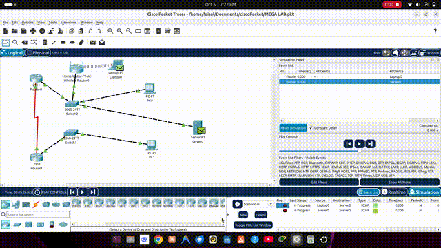

# 🌐 Mega Lab — Cisco Packet Tracer

A comprehensive **Cisco Packet Tracer** lab simulation featuring a full enterprise network topology.

## 🎬 Simulation Demo



## 📁 Files

| File | Description |
|------|-------------|
| `MEGA LAB.pkt` | Cisco Packet Tracer project file |
| `Simulation.mp4` | Video walkthrough / simulation demo |

---

## Phase 1: Physical Setup & Basic Configuration

### 1. Objective
1. Saare network devices (2 Routers, 2 Switches, 2 PCs, 1 Server) ko Packet Tracer mein rakhna.
2. Sahi cables ke zariye unhe connect karna.
3. Har device ko basic IP address dena taaki connectivity establish ho.
4. WAN (Router-to-Router) aur LAN (PC-to-Gateway) connectivity verify karna.

### 2. Device Selection

| # | Device Category | Exact Model | Quantity | Purpose |
|---|----------------|-------------|----------|---------|
| 1 | Network Devices > Routers | 2911 | 2 | HQ aur Branch ke liye |
| 2 | Network Devices > Switches | 2960-24TT | 2 | HQ aur Branch LAN ke liye |
| 3 | End Devices | PC-PT | 2 | HQ aur Branch ke PCs |
| 4 | End Devices | Server-PT | 1 | HQ Server |

### 3. Hardware Setup (Serial Module)
Router 2911 mein by default Serial port nahi hota. Steps:
1. Router par click → Physical tab
2. Power Switch OFF
3. HWIC-2T module drag to empty slot
4. Power Switch ON

### 4. Cabling

| Source Device | Source Port | Destination Device | Destination Port | Cable Type |
|--------------|------------|-------------------|-----------------|------------|
| Router0 (HQ) | GigabitEthernet0/0 | Switch2 (HQ) | FastEthernet0/1 | Copper Straight-Through |
| Router1 (Branch) | GigabitEthernet0/0 | Switch1 (Branch) | FastEthernet0/1 | Copper Straight-Through |
| Switch2 (HQ) | FastEthernet0/2 | PC0 | FastEthernet0 | Copper Straight-Through |
| Switch2 (HQ) | FastEthernet0/3 | Server0 | FastEthernet0 | Copper Straight-Through |
| Switch1 (Branch) | FastEthernet0/2 | PC1 | FastEthernet0 | Copper Straight-Through |
| Router0 (HQ) | Serial0/3/0 | Router1 (Branch) | Serial0/3/0 | Serial DCE (Red Cable) |

### 5. IP Addressing Table

| Device | Interface | IP Address | Subnet Mask | Gateway | Description |
|--------|-----------|-----------|-------------|---------|-------------|
| HQ_Router | Gig0/0 | 192.168.10.1 | 255.255.255.0 | - | HQ LAN Gateway |
| HQ_Router | Serial0/3/0 | 10.0.0.1 | 255.255.255.252 | - | WAN Link (DCE) |
| Branch_Router | Gig0/0 | 192.168.20.1 | 255.255.255.0 | - | Branch LAN Gateway |
| Branch_Router | Serial0/3/0 | 10.0.0.2 | 255.255.255.252 | - | WAN Link (DTE) |
| HQ_Switch | Vlan 1 | 192.168.10.2 | 255.255.255.0 | 192.168.10.1 | Management IP |
| Branch_Switch | Vlan 1 | 192.168.20.2 | 255.255.255.0 | 192.168.20.1 | Management IP |
| Server0 | NIC | 192.168.10.100 | 255.255.255.0 | 192.168.10.1 | HQ Server |
| PC0 | NIC | 192.168.10.10 | 255.255.255.0 | 192.168.10.1 | HQ PC |
| PC1 | NIC | 192.168.20.10 | 255.255.255.0 | 192.168.20.1 | Branch PC |

### 6. CLI Configuration Commands

**HQ_Router:**
```
enable
configure terminal
hostname HQ_Router
interface g0/0
ip address 192.168.10.1 255.255.255.0
no shutdown
exit
interface s0/3/0
ip address 10.0.0.1 255.255.255.252
clock rate 64000
no shutdown
exit
```

**Branch_Router:**
```
enable
configure terminal
hostname Branch_Router
interface g0/0
ip address 192.168.20.1 255.255.255.0
no shutdown
exit
interface s0/3/0
ip address 10.0.0.2 255.255.255.252
no shutdown
exit
```

**HQ_Switch:**
```
enable
configure terminal
hostname HQ_Switch
interface vlan 1
ip address 192.168.10.2 255.255.255.0
no shutdown
exit
ip default-gateway 192.168.10.1
exit
```

**Branch_Switch:**
```
enable
configure terminal
hostname Branch_Switch
interface vlan 1
ip address 192.168.20.2 255.255.255.0
no shutdown
exit
ip default-gateway 192.168.20.1
exit
```

**End Devices (GUI):**
- **PC0:** IP: 192.168.10.10, Mask: 255.255.255.0, Gateway: 192.168.10.1
- **PC1:** IP: 192.168.20.10, Mask: 255.255.255.0, Gateway: 192.168.20.1
- **Server0:** IP: 192.168.10.100, Mask: 255.255.255.0, Gateway: 192.168.10.1

### 7. Verification
- ✅ WAN Ping: `ping 10.0.0.2` → Reply from 10.0.0.2
- ✅ LAN Ping: `ping 192.168.10.1` → Reply from 192.168.10.1
- ✅ Interface Status: `show ip interface brief` → All up/up
- ✅ Routing Table: `show ip route` → Directly connected networks visible

---

## Phase 2: Switching & VLANs

### 1. Objective
1. Switch par VLANs banana (VLAN 10 aur VLAN 20).
2. Ports ko VLANs mein assign karna.
3. Uplink port ko Trunk mode mein configure karna.
4. Router par "Router-on-a-Stick" (Sub-interfaces) configure karna.

### 2. VLAN Plan

| VLAN ID | Name | Ports (HQ Side) | Ports (Branch Side) |
|---------|------|-----------------|---------------------|
| 10 | HR_Department | Fa0/2 (PC0) | Fa0/2 (PC1) |
| 20 | Server_Farm | Fa0/3 (Server0) | - |
| Trunk | Uplink | Fa0/1 (to Router) | Fa0/1 (to Router) |

### 3. Updated IP Table (Server VLAN Change)

| Device | Interface | IP Address | Subnet Mask | Gateway | VLAN |
|--------|-----------|-----------|-------------|---------|------|
| HQ_Router | Gig0/0.10 | 192.168.10.1 | 255.255.255.0 | - | VLAN 10 |
| HQ_Router | Gig0/0.20 | 192.168.30.1 | 255.255.255.0 | - | VLAN 20 |
| Server0 | NIC | 192.168.30.100 | 255.255.255.0 | 192.168.30.1 | VLAN 20 |
| PC0 | NIC | 192.168.10.10 | 255.255.255.0 | 192.168.10.1 | VLAN 10 |
| PC1 | NIC | 192.168.20.10 | 255.255.255.0 | 192.168.20.1 | VLAN 10 |

### 4. CLI Configuration

**HQ_Switch:**
```
enable
configure terminal
vlan 10
name HR_Department
vlan 20
name Server_Farm
exit
interface fa0/2
switchport mode access
switchport access vlan 10
exit
interface fa0/3
switchport mode access
switchport access vlan 20
exit
interface fa0/1
switchport mode trunk
exit
```

**Branch_Switch:**
```
enable
configure terminal
vlan 10
name HR_Department
exit
interface fa0/2
switchport mode access
switchport access vlan 10
exit
interface fa0/1
switchport mode trunk
exit
```

**HQ_Router (Router-on-a-Stick):**
```
enable
configure terminal
interface g0/0
no ip address
no shutdown
exit
interface g0/0.10
encapsulation dot1q 10
ip address 192.168.10.1 255.255.255.0
exit
interface g0/0.20
encapsulation dot1q 20
ip address 192.168.30.1 255.255.255.0
exit
```

**Server0 Update:** IP: 192.168.30.100, Mask: 255.255.255.0, Gateway: 192.168.30.1

### 5. Verification
- ✅ `show vlan brief` → VLAN 10 (Fa0/2), VLAN 20 (Fa0/3)
- ✅ `show interfaces trunk` → Fa0/1 trunking 802.1q
- ✅ `show ip interface brief` → Sub-interfaces up
- ✅ Inter-VLAN Ping: PC0 → Server0 (192.168.30.100) Successful
- ✅ WAN Ping: PC0 → PC1 (192.168.20.10) Successful

### 6. Common Mistakes
1. Router par Gig0/0 physical port par IP laga hua ho toh sub-interfaces kaam nahi karenge → `no ip address`
2. Sub-interface par `encapsulation dot1q` bhool jana
3. Switch uplink port par `switchport mode trunk` bhool jana
4. Server ka IP na badalna (ab VLAN 20: 192.168.30.100)
5. PC ka Gateway galat hona

---

## Phase 3: Routing & Inter-VLAN (OSPF)

### 1. Objective
1. OSPF dynamic routing protocol configure karna.
2. HQ_Router aur Branch_Router ke darmiyan routing establish karna.
3. HQ LAN, Server VLAN, aur Branch LAN aapas mein communicate kar sakein.
4. End-to-End connectivity verify karna.

### 2. OSPF Networks

| Router | Network ID | Wildcard Mask | Area |
|--------|-----------|---------------|------|
| HQ_Router | 192.168.10.0 | 0.0.0.255 | 0 |
| HQ_Router | 192.168.30.0 | 0.0.0.255 | 0 |
| HQ_Router | 10.0.0.0 | 0.0.0.3 | 0 |
| Branch_Router | 192.168.20.0 | 0.0.0.255 | 0 |
| Branch_Router | 10.0.0.0 | 0.0.0.3 | 0 |

### 3. CLI Configuration

**HQ_Router:**
```
enable
configure terminal
router ospf 1
network 192.168.10.0 0.0.0.255 area 0
network 192.168.30.0 0.0.0.255 area 0
network 10.0.0.0 0.0.0.3 area 0
exit
```

**Branch_Router:**
```
enable
configure terminal
router ospf 1
network 192.168.20.0 0.0.0.255 area 0
network 10.0.0.0 0.0.0.3 area 0
exit
```

### 4. Verification
- ✅ `show ip ospf neighbor` → Branch_Router FULL state
- ✅ `show ip route` → O 192.168.20.0/24 via 10.0.0.2
- ✅ PC0 → PC1: `ping 192.168.20.10` → Reply (0% loss)
- ✅ PC0 → Server: `ping 192.168.30.100` → Reply (0% loss)

### 5. Common Mistakes
1. Wildcard Mask galat lagana (0.0.0.255 use karein, NOT 255.255.255.0)
2. Area number dono routers par same hona chahiye (area 0)
3. WAN link (10.0.0.0) advertise karna na bhoolein
4. Interface down ho toh `clock rate` check karein (HQ side)

---

## Phase 4: Network Services (DHCP, DNS, HTTP)

### 1. Objective
1. HQ_Router par DHCP Server configure karna.
2. Server0 par DNS Server configure karna (www.mylab.com).
3. Server0 par HTTP Web Server configure karna.
4. PC0 ko DHCP par shift karke website open karna.

### 2. DHCP Pool Plan

| Pool Name | Network | Gateway | DNS Server | Range |
|-----------|---------|---------|------------|-------|
| VLAN10_POOL | 192.168.10.0 | 192.168.10.1 | 192.168.30.100 | .11 to .254 |

### 3. Configuration

**HQ_Router (DHCP):**
```
enable
configure terminal
ip dhcp pool VLAN10_POOL
network 192.168.10.0 255.255.255.0
default-router 192.168.10.1
dns-server 192.168.30.100
exit
ip domain-lookup
ip name-server 192.168.30.100
exit
```

**Server0 (DNS):**
1. Services → DNS → ON
2. Add Record: Name: `www.mylab.com`, Address: `192.168.30.100`

**Server0 (HTTP):**
1. Services → HTTP → ON
2. Edit HTML:
```html
<html>
<body>
<h1>Welcome to My Mega Lab</h1>
<p>This is a Cisco Packet Tracer Mega Lab.</p>
<p>Student: Syed Asad Abbas Shah</p>
<p>Program: Network Technology</p>
</body>
</html>
```

**PC0:** Switch from Static to DHCP → IP will be assigned automatically.

### 4. Verification
- ✅ `ipconfig` on PC0 → DHCP assigned IP
- ✅ `ping www.mylab.com` → Reply from 192.168.30.100
- ✅ Web Browser: `http://www.mylab.com` → Page opens
- ✅ `show ip dhcp binding` → PC0 MAC and IP visible

### 5. Common Mistakes
1. DHCP Pool mein `default-router` galat hona
2. DNS Server IP galat dalna (192.168.30.100 hona chahiye)
3. PC0 abhi bhi Static par hona
4. HTTP Service ON na karna
5. DNS Record add na karna
6. Routing theek na hona → pehle `ping 192.168.30.100` check karein

---

## Phase 5: Security & Wireless

### 1. Objective
1. SSH enable karna for secure remote access.
2. ACL lagana: Branch network se HTTP traffic block.
3. Wireless Router add karke WiFi connectivity setup.
4. Laptop ko WiFi se connect karna.

### 2. Plan

| Task | Device | Detail |
|------|--------|--------|
| SSH | HQ_Router | Username: admin, Password: cisco123 |
| ACL | HQ_Router | Branch (192.168.20.0/24) se HTTP block |
| Wireless | HomeRouter | SSID: Asad_Lab_WiFi, WPA2: cisco12345 |
| Laptop | Laptop0 | WiFi se connect |

### 3. Configuration

**Part A: SSH on HQ_Router:**
```
enable
configure terminal
hostname HQ_Router
ip domain-name mylab.com
crypto key generate rsa
! (Modulus size: 1024)
ip ssh version 2
username admin privilege 15 secret cisco123
line vty 0 4
transport input ssh
login local
exit
```

**Part B: ACL on HQ_Router:**
```
access-list 100 deny tcp 192.168.20.0 0.0.0.255 host 192.168.30.100 eq 80
access-list 100 permit ip any any
interface g0/0
ip access-group 100 in
exit
```

**Part C: Wireless Router:**
1. Add Wireless Router-PT → Connect to Switch2 Fa0/5 via Straight-Through cable
2. GUI → Internet Setup: DHCP → Save
3. Wireless Setup: SSID: `Asad_Lab_WiFi`, Broadcast: Enabled → Save
4. Wireless Security: WPA2 Personal, Passphrase: `cisco12345` → Save

**Part D: Laptop Connect:**
1. Laptop0 → Physical tab → Power OFF
2. Drag WPC300N module to empty slot
3. Power ON
4. Desktop → PC Wireless → Connect → Select `Asad_Lab_WiFi`
5. Passphrase: `cisco12345`
6. Desktop → IP Configuration → DHCP

### 4. Verification
- ✅ SSH: `ssh -l admin 192.168.10.1` → Password: cisco123 → HQ_Router# prompt
- ✅ ACL Block: PC1 → Web Browser → `http://www.mylab.com` → Request Timeout
- ✅ ACL Allow: PC0 → Web Browser → `http://www.mylab.com` → Website opens
- ✅ Wireless: Laptop0 → `ping 192.168.10.1` & `ping 192.168.30.100` → Successful

### 5. Common Mistakes
1. `crypto key generate rsa` bhool jana → SSH fail
2. ACL galat interface par lagana → `g0/0` par `in` direction
3. `permit ip any any` bhool jana → saara traffic block
4. Laptop mein WPC300N module na lagana
5. Wireless Router ka Internet port use karein, LAN port nahi
6. SSID ya Password galat dalna

---

## Phase 6: Final Simulation & Troubleshooting

### 1. Objective
1. Simulation Mode se data travel visually verify karna.
2. Har device par packet flow dekhna (Layer 2 & Layer 3).
3. ACL block traffic simulate karna.
4. End-to-end connectivity finalize karna.

### 2. Simulation Plan

| Test | Source | Destination | Protocol | Expected Result |
|------|--------|------------|----------|----------------|
| 1 | Laptop0 | Server0 | ICMP (Ping) | ✅ Successful |
| 2 | PC0 | PC1 (Branch) | ICMP (Ping) | ✅ Successful (OSPF) |
| 3 | PC1 (Branch) | Server0 | HTTP | ❌ Blocked (ACL Drop) |
| 4 | PC0 | Server0 | HTTP | ✅ Allowed (Web Page) |

### 3. Simulation Steps
1. **Simulation Mode ON:** Bottom-right corner → Click "Realtime" → Changes to "Simulation"
2. **Send PDU:** Add Simple PDU → Click Source (Laptop0) → Click Destination (Server0) → Play
3. **Check Data Travel:** Envelope travels through Wireless Router → Switch2 → HQ_Router → Server0. Click envelope to see Layer 2 (MAC) and Layer 3 (IP) info.
4. **ACL Block Simulation:** Add Simple PDU: PC1 → Server0 → Play → Red X (Drop) at HQ_Router
5. **Return to Realtime:** Bottom-right → Click "Realtime"

### 4. Final Verification
- ✅ Laptop → Server: `ping 192.168.30.100` → Reply (0% loss)
- ✅ PC0 → PC1: `ping 192.168.20.10` → Reply (0% loss)
- ✅ ACL Block: PC1 → `http://www.mylab.com` → Request Timeout
- ✅ ACL Allow: PC0 → `http://www.mylab.com` → Page opens
- ✅ DHCP: `show ip dhcp binding` → PC0 listed

### 5. Troubleshooting Guide

| Problem | Solution |
|---------|----------|
| Laptop se ping fail | Wireless Router IP check, Switch port VLAN 10 mein hai ya nahi |
| PC0 se PC1 ping fail | `show ip ospf neighbor` check karein |
| Web page nahi khul raha | DNS record check, HTTP service ON check |
| SSH login fail | `crypto key generate rsa` dobara, username/password check |
| ACL block nahi kar raha | Interface `g0/0` par `in` direction, `permit ip any any` check |

### 6. Conclusion
Is Mega Lab mein humne ek complete enterprise network banaya jisme:
- ✅ VLANs (VLAN 10 aur 20) banaye
- ✅ Inter-VLAN Routing (Router-on-a-Stick) configure kiya
- ✅ OSPF dynamic routing se HQ aur Branch ko joda
- ✅ DHCP, DNS, HTTP services provide kiye
- ✅ SSH se remote access secure kiya
- ✅ ACL se Branch ka HTTP traffic block kiya
- ✅ Wireless connectivity setup ki

---

## 🚀 How to Use

1. Download and install [Cisco Packet Tracer](https://www.netacad.com/courses/packet-tracer)
2. Clone this repository:
   ```bash
   git clone https://github.com/Kazyaar-Faisal/Mega-Lab-Packet-Tracer.git
   ```
3. Open `MEGA LAB.pkt` in Packet Tracer
4. Follow the phases above step by step

---

*Made by [Kazyaar-Faisal](https://github.com/Kazyaar-Faisal)*
